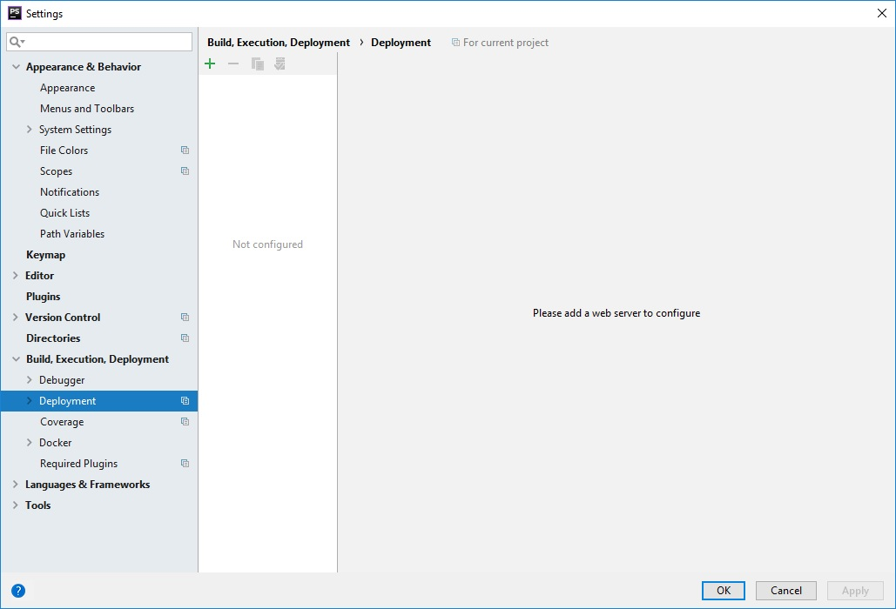
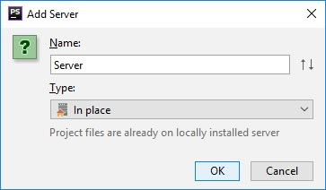
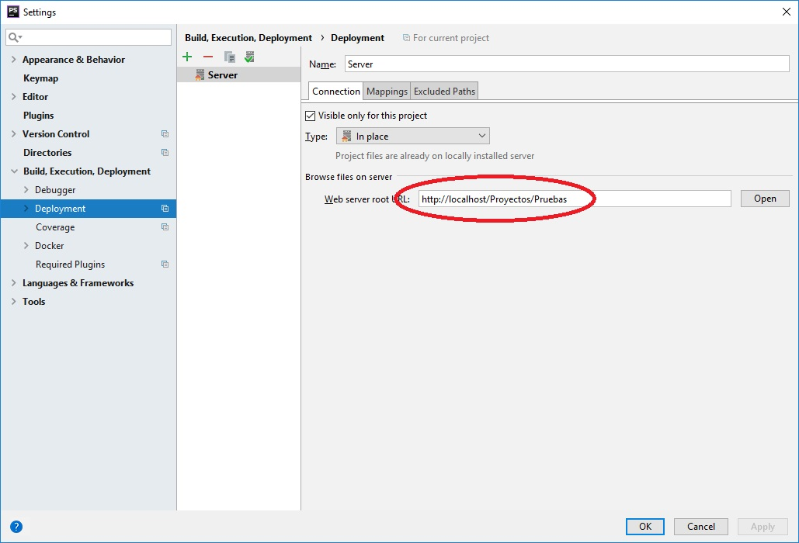

# Información manejo Laravel

### Creación de un nuevo proyecto
Para la creación de un nuevo proyecto, debemos situarnos en la ruta elegida, esta debe ser la ruta padre donde se generará el nuevo poryecto y utilizar composer
```
composer create-project laravel/laravel pru01 "5.7.*"
```

Despues creamos una bbdd en mysql, por ejemplo <code>pruebas</code>

Abrimos el proyecto y en el archivo <code>.env</code> sustiuimos los valores para conectar a la bbdd
```
DB_DATABASE=prueba
DB_USERNAME=root
DB_PASSWORD=xxxxx
```
Seguidamente configuramos IntelliJ para poder ejecutar en local.




### Generación de la info de BBDD
Para asegurarno que no aparece el error:
```
PDOException::("SQLSTATE[42000]: Syntax error or access violation: 1071 Specified key was too long; max key length is 767 bytes")
```
tenemos que modificar el siguiente archivo incluyendo lo siguiente:
<code>app/providers/AppServiceProvider.php</code>

```php
<?php

namespace App\Providers;

use Illuminate\Support\ServiceProvider;
use Illuminate\Support\Facades\Schema; <--añadir esta linea

class AppServiceProvider extends ServiceProvider
{
    /**
     * Bootstrap any application services.
     *
     * @return void
     */
    public function boot()
    {
        Schema::defaultStringLength(191); <--añadir esta linea
    }

    /**
     * Register any application services.
     *
     * @return void
     */
    public function register()
    {
        //
    }
}
```

después en el directorio del proyecto, escribimos:
```bash
php artisan migrate
```

### Generar las opciones de autentificación
Para ello en el directorio del proyecto escribiremos:
```
php artisan make:auth
```

## Subir a Github el proyecto
En el directorio local, inicializaremos GIT
```
H:\SERVIDOR-LOCAL\Ampps\www\Proyectos\gestionv3>git init
Initialized empty Git repository in H:/SERVIDOR-LOCAL/Ampps/www/Proyectos/gestionv3/.git/

H:\SERVIDOR-LOCAL\Ampps\www\Proyectos\gestionv3>
```
Después crearemos un nuevo repositorio en github (gestionv3)

Antes de subirlo, necesitamos modificar el fichero <code>.gitignore</code> para que incluya la carpeta /vendor en la sincronización:
```
/node_modules
/public/hot
/public/storage
/storage/*.key
#/vendor <-- Comentar o quitar esta línea
.env
.phpunit.result.cache
Homestead.json
Homestead.yaml
npm-debug.log
yarn-error.log
```
y en el directorio local lo subiremos:
```
git remote add origin https://github.com/usuarioregalonatural/gestionv3.git
git add *
git commit -m "Commit Inicial"
git push -u origin master
```
## Sincronización en el Server
Nos movemos al servidor, y en el directorio padre donde vayamos a crearlo, lo clonamos:
```
[root@vicsoft Gestion]# git clone https://github.com/usuarioregalonatural/gestionv3.git
```
Esto nos creará la carpeta con el proyecto.

Acto seguido creamos en link simbólico en la carpeta de acceso web del servidor hacia donde tenemos nuestro proyecto:
```bash
[root@vicsoft html]# pwd
/var/www/html
[root@vicsoft html]# mv gestion 20181225-gestion
[root@vicsoft html]# ln -s /home/webs/Gestion/gestionv3/public gestion
```
Después le asignamos permisos y propietarios a la carpeta:
 ```bash
[root@vicsoft gestionv3]# chown -R www-data:apache *
[root@vicsoft gestionv3]# chmod -R 777 *
```

### Configurar Laravel en Producción
Primer paso copiar el fichero de entorno ejemplo como final
```bash
cp .env.example .env
```
Luego editamos el fichero <code>.env</code> y modificamos lo siguiente:
```bash
APP_ENV=production <-- esto
APP_DEBUG=false <-- esto
APP_KEY=SomeRandomString (esto se genera luego)

DB_HOST=localhost <-- esto
DB_DATABASE=gestionatural <-- esto
DB_USERNAME=root <-- esto
DB_PASSWORD=XXXXXXXXX <-- esto
```

Una vez realizadas las modificaciones, guardaremos y generaremos la APP_KEY

```bash
php artisan key:generate
```
luego ir al fichero <code>config/app.php</code> y confirmar que la url es la adecuada

### Configurar Cache
Es bueno recompilar los ficheros de configuración para que el cacheo se haga bien
Dentro del directorio de la aplicación (*/home/webs/gestion-natural/Gestion-Ralucart*)

```bash
php artisan config:cache
```
Después debe aparece un mensaje como este:
```bash
[root@vicsoft Gestion-Ralucart]# php artisan config:cache
Configuration cache cleared!
Configuration cached successfully!
```

### Migrar la base de datos
A continuación procederemos a migrar las tablas a la bbdd de producción:
 ```bash
[root@vicsoft gesralv1]# php artisan migrate
**************************************
*     Application In Production!     *
**************************************

 Do you really wish to run this command? (yes/no) [no]:
 > yes

Migration table created successfully.
Migrating: 2014_10_12_000000_create_users_table
Migrated:  2014_10_12_000000_create_users_table
Migrating: 2014_10_12_100000_create_password_resets_table
Migrated:  2014_10_12_100000_create_password_resets_table
[root@vicsoft gesralv1]#
 ```
 Con esto ya tendremos lista la web en su forma operativa de autentificación básica.
 
 **En adelante todo lo que hagamos será en nuevas ramas de git verificando que funciona.**
 
 
 ## Instalar AdminLTE
 Esta es una plantilla para Laravel que utilizaremos.
 
 En principio vamos a hacer la instalación en local para ello en IntelliJ.
 Lo primero será crear una nueva rama, una vez creada y situandonos en ella, en el terminal escribiremos:
 ```
 composer require jeroennoten/laravel-adminlte
 ```
 si todo ha ido bien, configuraremos el archivo **config/app.php** para incluir lo siguiente:
 ```php
 'providers' => [

	....

	JeroenNoten\LaravelAdminLte\ServiceProvider::class,

],
 
```
una vez modificado ejecutaremos:
```bash
php artisan vendor:publish --provider="JeroenNoten\LaravelAdminLte\ServiceProvider" --tag=assets
```
y luego lo siguiente:
```php
php artisan vendor:publish --provider="JeroenNoten\LaravelAdminLte\ServiceProvider" --tag=config
```

Teoricamente ya está configurado AdminLTE, ahora vamos a ver si es así:

#### Comprobación de AdminLTE
Nos vamos al archivo <code>routes/web.php</code> y lo editamos indicando la siguiente línea:
```php
Route::get('home', function () {return view('home');});

```
Es necesario que exista este archivo <code>views/home.blade.php</code> que será al que redireccionará la ruta.

Editaremos el archivo <code>views/home.blade.php</code> para cambiar layouts.app por el de AdminLTE e indicaremos un Dashboard:
 ```php
 @extends('adminlte::page')


@section('title', 'Dashboard')


@section('content_header')

    <h1>Ultima Semana</h1>
    <!--    <link href="css/bootstrap.min.css" rel="stylesheet"> -->
@stop


@section('content')


<!--    <div class="alert alert-danger alert-dismissible">
        <button type="button" class="close" data-dismiss="alert" aria-hidden="true">&times;</button>
        <h5><i class="icon fa fa-ban"></i> Alert!</h5>
        Danger alert preview. This alert is dismissable. A wonderful serenity has taken possession of my
        entire
        soul, like these sweet mornings of spring which I enjoy with my whole heart.
    </div>
    <div class="alert alert-info alert-dismissible">
        <button type="button" class="close" data-dismiss="alert" aria-hidden="true">&times;</button>
        <h5><i class="icon fa fa-info"></i> Alert!</h5>
        Info alert preview. This alert is dismissable.
    </div>
-->
    <!-- Small Box (Stat card) -->
    <h5 class="mb-2 mt-4"><b></b></h5>
    <div class="row">
        <!-- /.col -->
        <div class="col-lg-3 col-6">
            <!-- small card -->
            <div class="small-box bg-info">
                <div class="inner">
                    <h3>150</h3>

                    <p>Nuevos Pedidos</p>
                </div>
                <div class="icon">
                    <i class="fa fa-shopping-cart"></i>
                </div>
                <a href="#" class="small-box-footer">
                    More info <i class="fa fa-arrow-circle-right"></i>
                </a>
            </div>
        </div>
       <!-- /.col -->
        <!-- /.col -->
        <div class="col-lg-3 col-6">
            <!-- small card -->
            <div class="small-box bg-success">
                <div class="inner">
                    <h3>2.330,43 </h3>

                    <p>Ingresos</p>
                </div>
                <div class="icon">
                    <i class="ion ion-stats-bars"></i>
                </div>
                <a href="#" class="small-box-footer">
                    More info <i class="fa fa-arrow-circle-right"></i>
                </a>
            </div>
        </div>
        <!-- /.col -->
        <!-- /.col -->
        <div class="col-lg-3 col-6">
            <!-- small card -->
            <div class="small-box bg-danger">
                <div class="inner">
                    <h3>-876,55 </h3>

                    <p>Gastos</p>
                </div>
                <div class="icon">
                    <i class="ion ion-social-euro"></i>
                </div>
                <a href="#" class="small-box-footer">
                    More info <i class="fa fa-arrow-circle-right"></i>
                </a>
            </div>
        </div>
        <!-- /.col -->
    </div>
<!-- row-->
    <div class="container-fluid">
        <h5 class="mb-2"></h5>
        <div class="row">

        <div>
            <!-- col-->
            <div class="col-md-3 col-sm-6 col-12">
                <div class="info-box">
                    <span class="info-box-icon bg-info" ><i class="fa fa-american-sign-language-interpreting"></i>
                     <!--   <i class="fa fa-caret-square-o-right"></i> -->
                    </span>

                    <div class="info-box-content" >
                        <span class="info-box-text">Pedidos pendientes preparar</span>
                        <span class="info-box-number">12</span>
                    </div>
                    <!-- /.info-box-content -->
                </div>
                <!-- /.info-box -->
            </div>
            <!-- col-->
            <div class="col-md-3 col-sm-6 col-12">
                <div class="info-box">
                    <span class="info-box-icon bg-success" ><i class="fa fa-ship"></i>
                        <!--   <i class="fa fa-caret-square-o-right"></i> -->
                    </span>

                    <div class="info-box-content" >
                        <span class="info-box-text">Pedidos pendientes enviar</span>
                        <span class="info-box-number">3</span>
                    </div>
                    <!-- /.info-box-content -->
                </div>
                <!-- /.info-box -->
            </div>
            <!-- col-->

        </div>

        </div>
        <!-- /.info-box-content -->
    </div>
    <!-- /.info-box -->
    </div>
    <!-- /.col -->
    </div>
    <!-- /.row -->
@stop


@section('css')

    <link rel="stylesheet" href="/css/admin_custom.css">

@stop


@section('js')

    <script> console.log('Hi!'); </script>
    <!--   <script src="js/bootstrap.min.js"></script> -->
@stop


```
una vez registrados, debería llevarnos a la pantalla con formato AdminLTE y su dashboard

#### Actualización en Servidor
Ahora actualizaremos en github en el servidor
* en IntelliJ haremos un <code>git add * </code> para incluir los nuevos archivos y cambios.
* Luego haremos **commit** y **push** con lo que se quedará la nueva rama incluida en github y pendiente de pull request. Esperamos a hacer el pull request.

* En el server haremos un pull para actualizar con los nuevos ficheros:
```bash 
[root@vicsoft gesralv1]# git pull
[root@vicsoft gesralv1]# git pull
remote: Enumerating objects: 207, done.
remote: Counting objects: 100% (207/207), done.
remote: Compressing objects: 100% (103/103), done.
remote: Total 187 (delta 54), reused 187 (delta 54), pack-reused 0
Receiving objects: 100% (187/187), 1.47 MiB | 0 bytes/s, done.
Resolving deltas: 100% (54/54), completed with 19 local objects.
From https://github.com/usuarioregalonatural/gesralv1
 * [new branch]      01-Instalar-AdminLTE -> origin/01-Instalar-AdminLTE
Already up-to-date.
```
- Nos creará la nueva rama en el servidor y pasaremos a cambiar a esta rama:
```bash
[root@vicsoft gesralv1]# git checkout 01-Instalar-AdminLTE
Branch 01-Instalar-AdminLTE set up to track remote branch 01-Instalar-AdminLTE from origin.
Switched to a new branch '01-Instalar-AdminLTE'
```
Ahora vamos a dar permisos y propietarios a todo para que se incluya lo nuevo:
```bash
[root@vicsoft gesralv1]# chown -R www-data:apache *
[root@vicsoft gesralv1]# chmod -R 777 *
```

Probablemente en la rama nueva dentro del servidor tenemos que actualizar lo nuevo:
```bash
git add *
git commit -m "actualizacion"
php artisan config:cache
php artisan config:clear
```
ahora debería mostrarse el dashboard de home correctamente estando en el server en la rama nueva y podremos hacer el pull request en git hub para mergear la rama dentro de master

